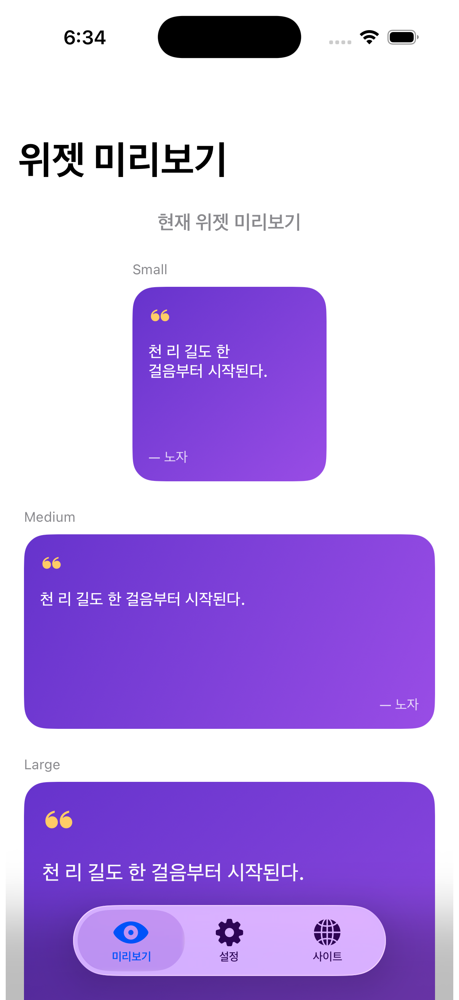
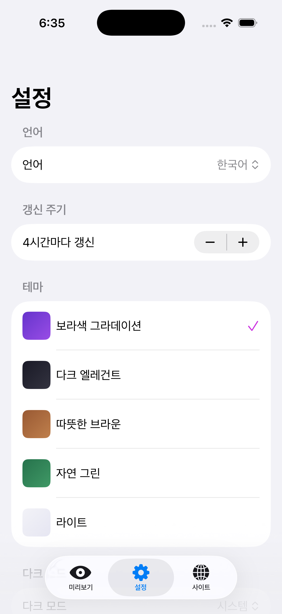
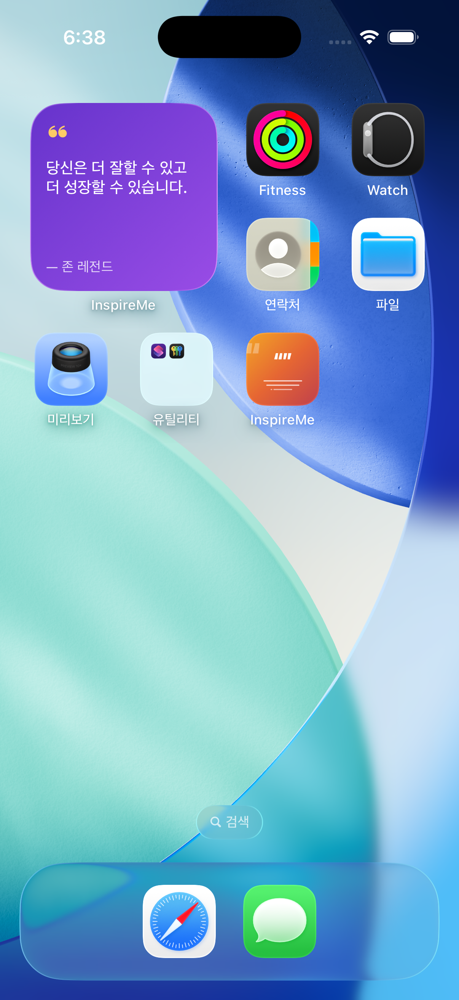
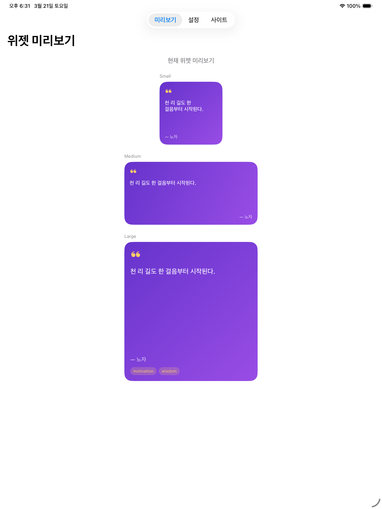
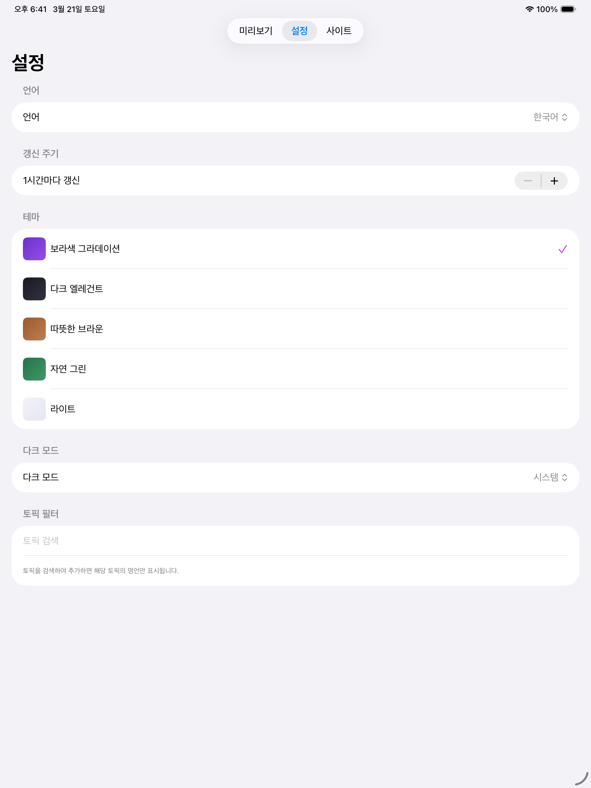
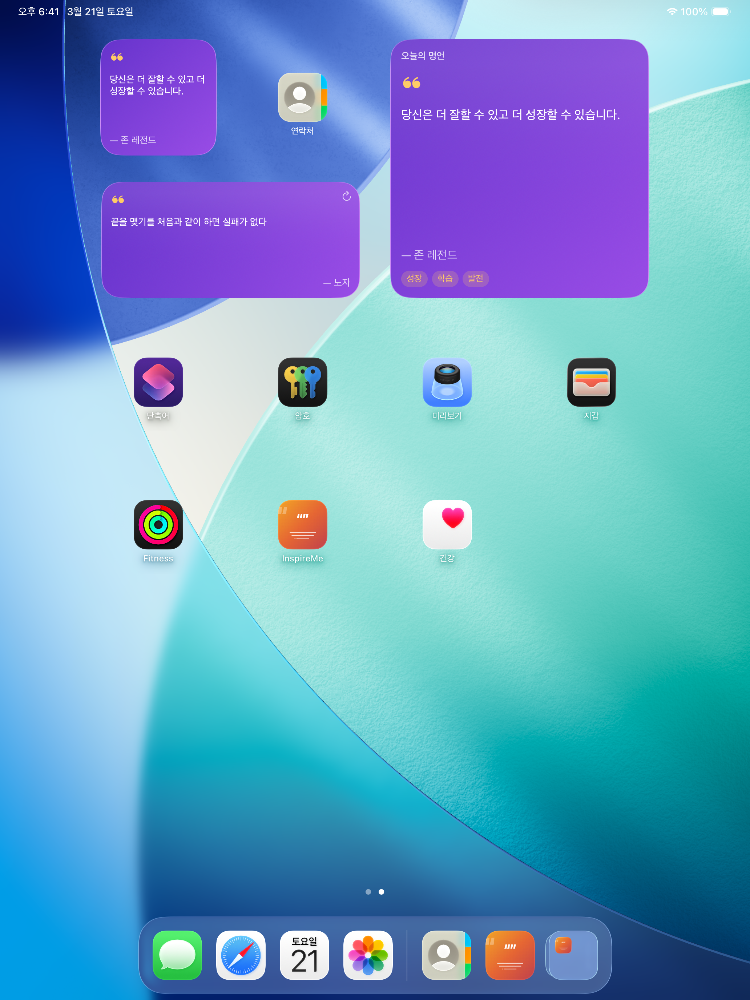

# InspireMe iOS

[InspireMe](https://inspire-me.advenoh.pe.kr) 명언 플랫폼의 iOS/macOS 위젯 앱.
홈 화면, 잠금 화면, 데스크탑에서 명언을 보여주고, 탭하면 InspireMe 웹사이트로 이동합니다.

## 스크린샷

### iPhone

| 위젯 미리보기 | 설정 | 홈 화면 위젯 |
|:---:|:---:|:---:|
|  |  |  |

### iPad

| 위젯 미리보기 | 설정 | 홈 화면 위젯 |
|:---:|:---:|:---:|
|  |  |  |

## 주요 기능

- **오늘의 명언 위젯** — 하루 1개 명언을 고정 표시
- **랜덤 명언 위젯** — 설정된 주기(1~72시간)마다 새로운 명언 표시
- **멀티 플랫폼** — iPhone, iPad, Mac 지원
- **다양한 위젯 크기** — Small, Medium, Large, Lock Screen
- **테마 선택** — Gradient, Dark, Warm, Nature, Light (5종)
- **토픽 필터** — 서버 기반 자동완성 검색으로 토픽 선택
- **탭 동작** — 명언 탭 → 명언 상세 페이지, 저자 탭 → 저자 페이지로 이동
- **인앱 브라우저** — iPhone/iPad에서 SFSafariViewController로 열기
- **사이트 탭** — 앱 내에서 InspireMe 웹사이트 바로 보기

## 기술 스택

| 항목 | 내용 |
|------|------|
| 언어 | Swift 6 (Strict Concurrency) |
| UI | SwiftUI, WidgetKit, AppIntents |
| 최소 버전 | iOS 17+, iPadOS 17+, macOS 14+ (Sonoma) |
| 프로젝트 생성 | XcodeGen |
| 백엔드 | InspireMe Widget API |
| 의존성 | 외부 라이브러리 없음 (Apple 프레임워크만 사용) |

## 프로젝트 구조

```
inspireme.ios/
├── InspireMe/                    # 메인 앱
│   ├── InspireMeApp.swift        # 앱 진입점 (딥링크 처리)
│   └── Views/
│       ├── ContentView.swift     # 온보딩/메인 분기
│       ├── MainTabView.swift     # 탭 뷰 (미리보기, 설정, 사이트)
│       ├── WidgetPreviewView.swift
│       ├── SettingsView.swift    # 언어, 갱신주기, 테마, 토픽 필터
│       ├── OnboardingView.swift
│       ├── SafariView.swift      # 인앱 브라우저
│       └── WebView.swift         # 사이트 탭 (WKWebView)
├── InspireMeWidget/              # WidgetKit Extension
│   ├── QuoteOfTheDayWidget.swift # 오늘의 명언 위젯
│   ├── RandomQuoteWidget.swift   # 랜덤 명언 위젯
│   ├── QuoteOfTheDayProvider.swift
│   ├── RandomQuoteProvider.swift
│   ├── QuoteEntry.swift          # Timeline Entry + URL 생성
│   ├── RefreshQuoteIntent.swift  # 새로고침 AppIntent
│   └── Views/                    # Small, Medium, Large, LockScreen
├── Shared/                       # 앱 ↔ 위젯 공유 코드
│   ├── Models/
│   │   ├── Quote.swift           # Quote, QuoteResponse, TopicsResponse
│   │   └── WidgetTheme.swift     # 5종 테마 정의
│   ├── Services/
│   │   ├── InspireMeAPI.swift    # API 클라이언트
│   │   └── AppGroupManager.swift # 설정값/캐시 공유
│   └── Views/
│       └── QuoteContentViews.swift
├── project.yml                   # XcodeGen 설정
└── docs/
    ├── screenshots/              # 스크린샷
    └── start/
        ├── 1_inspire_ios_prd.md
        ├── 1_inspire_ios_implementation.md
        └── 1_inspire_ios_todo.md
```

## 설치 방법

### 준비물

- Mac (macOS 14 Sonoma 이상)
- Xcode 16+ ([Mac App Store](https://apps.apple.com/app/xcode/id497799835)에서 무료 설치)
- XcodeGen (`brew install xcodegen`)
- Apple 계정 (무료 계정으로 충분)

### Step 1. 소스 클론 및 프로젝트 생성

```bash
git clone https://github.com/kenshin579/inspireme.ios.git
cd inspireme.ios
xcodegen generate
open InspireMe.xcodeproj
```

### Step 2. Xcode에서 서명 설정

두 타겟 모두 본인 계정으로 변경해야 합니다.

1. Xcode 좌측 패널에서 **InspireMe** 프로젝트 클릭
2. **InspireMe** 타겟 선택 → **Signing & Capabilities** 탭
   - **Team**: 본인 Apple ID 선택
   - **Bundle Identifier**: 고유한 값으로 변경 (예: `com.yourname.inspireme`)
3. **InspireMeWidgetExtension** 타겟도 동일하게 변경
   - **Team**: 본인 Apple ID 선택
   - **Bundle Identifier**: 메인 앱 하위로 변경 (예: `com.yourname.inspireme.widget`)

### Step 3. 기기에 빌드 & 실행

| 플랫폼 | 방법 |
|--------|------|
| **iPhone / iPad** | USB로 Mac에 연결 → Xcode 상단에서 기기 선택 → **Run** (Cmd+R) |
| **Mac** (Apple Silicon) | Xcode 상단에서 **My Mac (Designed for iPad)** 선택 → **Run** (Cmd+R) |

처음 실행 시 iPhone/iPad에서 **설정 → 일반 → VPN 및 기기 관리**에서 개발자 앱을 신뢰해야 합니다.

> **참고**: 무료 Apple 계정은 7일마다 앱을 다시 빌드해야 합니다. Apple Developer Program ($99/year) 가입 시 이 제한이 없어집니다.

## 개발 가이드

### 필수 요구사항

- Xcode 16+ (Swift 6 지원)
- macOS 14+ (Sonoma)
- XcodeGen (`brew install xcodegen`)
- Apple Developer 계정 (App Group, WidgetKit Extension 설정에 필요)

### Makefile 명령어

```bash
make help        # 전체 명령어 목록

# 개발
make generate    # XcodeGen으로 .xcodeproj 생성
make build-sim   # iOS 시뮬레이터 빌드
make build       # iOS 디바이스 빌드 (서명 없음)
make open        # Xcode에서 프로젝트 열기

# 릴리스
make archive     # Release 아카이브 생성
make tag patch   # 패치 버전 태그 + GitHub Release (v1.0.0 → v1.0.1)
make tag minor   # 마이너 버전 태그 + GitHub Release (v1.0.0 → v1.1.0)
make tag major   # 메이저 버전 태그 + GitHub Release (v1.0.0 → v2.0.0)
make clean       # 빌드 결과물 삭제
```

### CLI 빌드

```bash
# iPhone 시뮬레이터
make build-sim

# Mac (Designed for iPad)
xcodebuild build -project InspireMe.xcodeproj -scheme InspireMe \
  -destination 'platform=macOS,variant=Designed for iPad' -allowProvisioningUpdates
```

### 시뮬레이터에서 실행

```bash
# iOS 시뮬레이터 런타임 설치
xcodebuild -downloadPlatform iOS

# 시뮬레이터 실행
xcrun simctl boot "iPhone 17 Pro"
open -a Simulator

# 앱 설치 & 실행
xcrun simctl install booted <빌드된 .app 경로>
xcrun simctl launch booted pe.kr.advenoh.inspireme
```

## 사용 API

InspireMe Widget API를 사용합니다 (인증 불필요).

```
GET /api/widget/quote-of-the-day?lang={ko|en}              # 오늘의 명언
GET /api/widget/random?lang={ko|en}&count=1&topics={토픽}   # 랜덤 명언
GET /api/widget/topics?q={검색어}&lang={ko|en}              # 토픽 검색
```

## 문서

- [PRD (기능 명세 및 결정 사항)](docs/start/1_inspire_ios_prd.md)
- [구현 문서](docs/start/1_inspire_ios_implementation.md)
- [TODO 체크리스트](docs/start/1_inspire_ios_todo.md)

## 관련 프로젝트

| 프로젝트 | 설명 |
|---------|------|
| [inspireme.advenoh.pe.kr](https://github.com/kenshin579/inspireme.advenoh.pe.kr) | InspireMe 웹 플랫폼 (Next.js + Go) |
| [app-quotememtum](https://github.com/kenshin579/app-quotememtum) | 명언 Chrome Extension |
